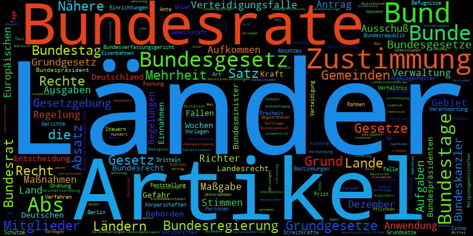

# GG-Wordcloud

A wordcloud made out of German constitution (= Grundgesetz, GG)

# Installation

Activate [virtualenv](http://docs.python-guide.org/en/latest/dev/virtualenvs/#virtualenvwrapper).

Install dependencies via `pip install -r requirements.txt'.

# Example

# License

MIT
